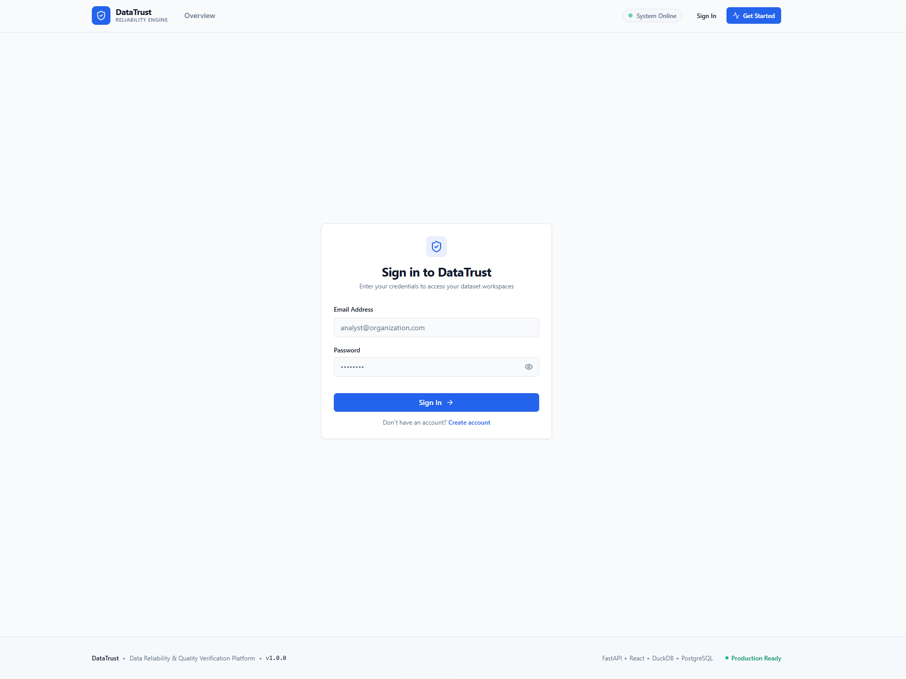
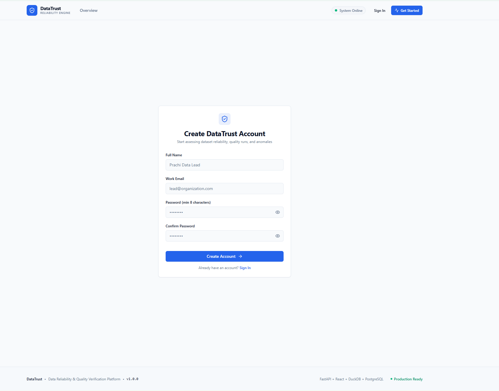
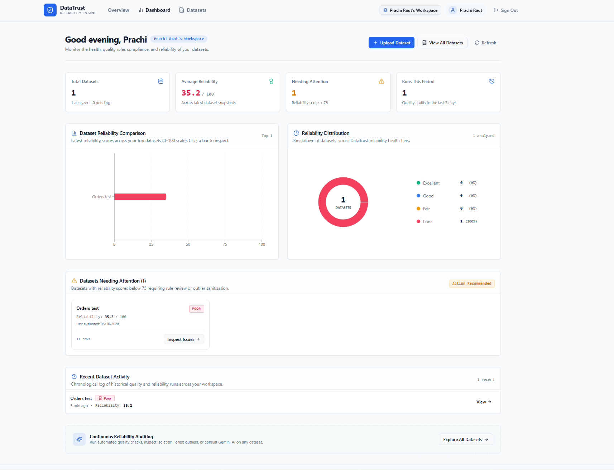
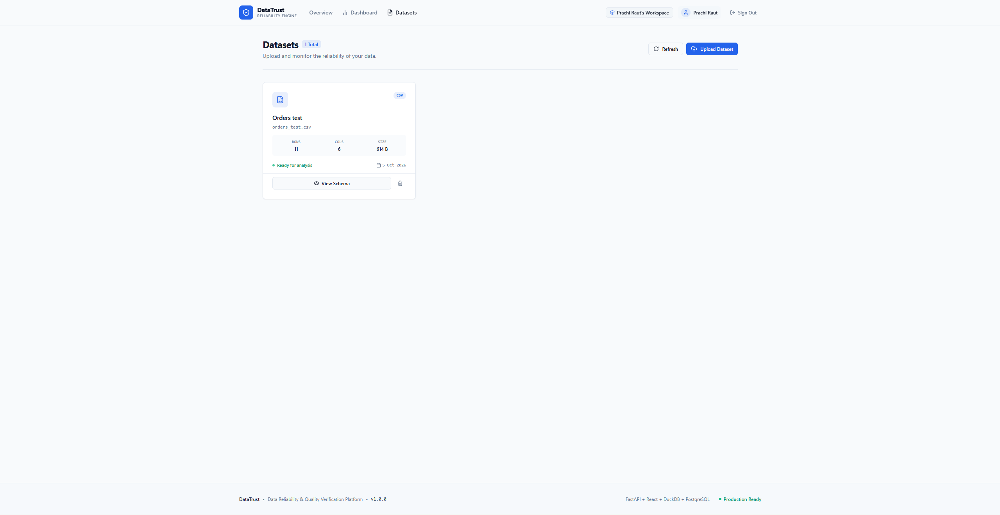
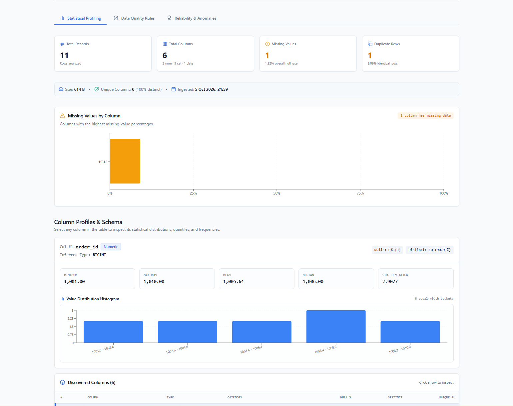
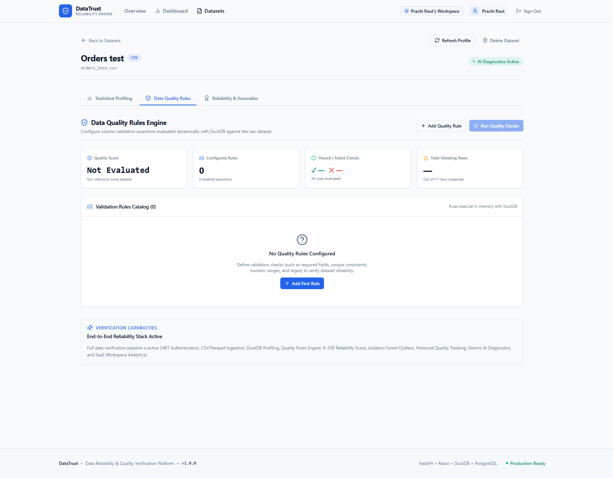
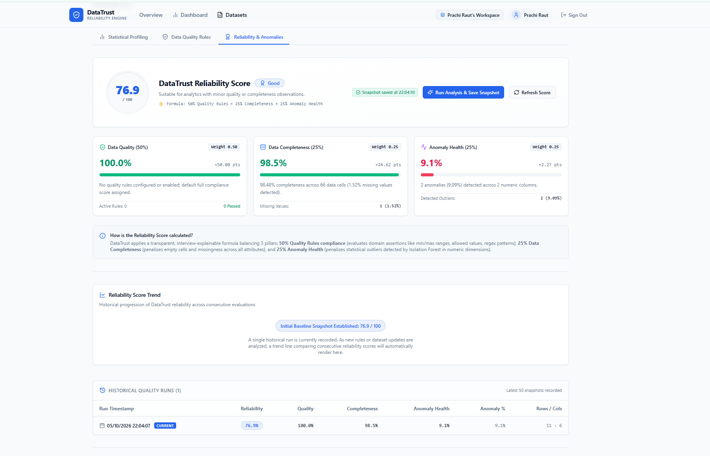
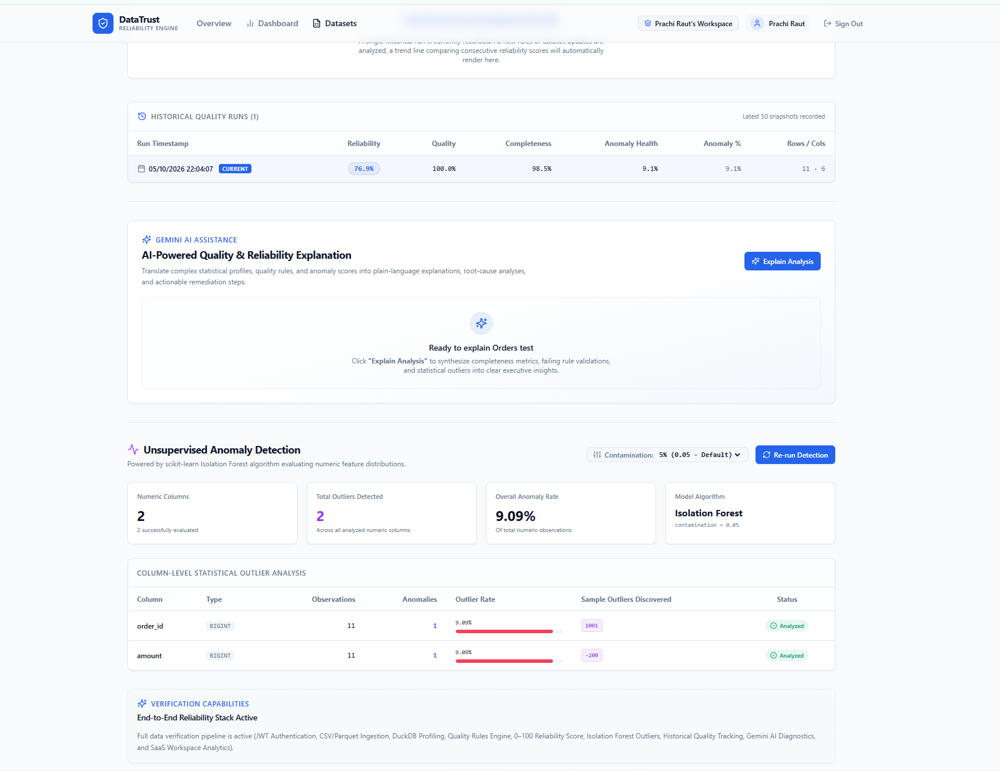

# DataTrust

DataTrust is a data quality and reliability intelligence platform that empowers users to upload datasets, profile data, validate quality rules, detect anomalies, calculate an explainable reliability score, and get AI-generated diagnostic explanations.

## Live Demo

[DataTrust](https://data-trust-three.vercel.app/)

## Features

- **CSV/Parquet Dataset Upload**: Seamless ingestion of CSV and Parquet files with zero cloud lock-in.
- **Automated Statistical Profiling**: Fast in-process computation of quantiles, distributions, frequencies, and missingness powered by DuckDB.
- **Data Quality Validation Rules**: Configurable rule engine for completeness, uniqueness, numeric ranges, permitted values, and date checks.
- **Missing/Duplicate/Invalid Data Analysis**: Rapid discovery of data hygiene issues and schema violations.
- **Isolation Forest Anomaly Detection**: Unsupervised statistical outlier detection isolating suspicious multivariate data points.
- **Reliability Score**: Objective 0–100 score combining quality compliance, completeness, and anomaly health.
- **Historical Quality Tracking**: Run-over-run quality snapshots and trend tracking across consecutive audits.
- **Gemini-Powered Explanations**: Plain-language summaries and remediation advice synthesized strictly from aggregated metrics without transmitting raw dataset rows.

## Tech Stack

- **Frontend**: React, TypeScript, Vite, Tailwind CSS, shadcn/ui, Recharts
- **Backend**: FastAPI, Pydantic, SQLAlchemy, Alembic
- **Data & ML**: DuckDB, Pandas, NumPy, scikit-learn
- **Database**: PostgreSQL / Neon
- **AI**: Google Gemini
- **Deployment**: Vercel, Render, Neon, Docker, GitHub Actions

## How It Works

```text
Upload Dataset → Profile Data → Apply Quality Rules → Detect Anomalies → Calculate Reliability → Track History → Generate AI Explanation
```

DataTrust guides tabular datasets through an automated verification pipeline that calculates an objective trust score and actionable AI recommendations before data reaches downstream analytics or ML models.

## Screenshots

### Sign In


### Sign Up


### Dashboard


### Dataset Upload


### Statistical Profiling


### Data Quality Rules


### Reliability Score


### AI-Powered Quality & Reliability Explanation


## Reliability Score

Reliability Score = 50% Quality + 25% Completeness + 25% Anomaly Health

### Tiers

- **Excellent**: 90–100
- **Good**: 75–89.99
- **Fair**: 60–74.99
- **Poor**: below 60

## Privacy

DataTrust maintains strict data privacy boundaries. Google Gemini receives only aggregated quality metrics, rule failure information, and anomaly statistics for explanations. Raw dataset rows, cell values, and credentials are not sent to Gemini.

## Run Locally

### Prerequisites

- Python 3.11+
- Node.js (v18+)
- PostgreSQL or Docker

### Option 1: Docker Compose

```bash
docker compose up --build
```

- Frontend: `http://localhost:3000`
- Backend API: `http://localhost:8000`
- Swagger Docs: `http://localhost:8000/docs`

### Option 2: Manual Setup

Configure environment variables using the existing `.env.example` templates in the root, `backend/`, and `frontend/` directories.

**Backend**:
```bash
cd backend
python -m venv .venv
source .venv/bin/activate  # On Windows: .\.venv\Scripts\activate
pip install -r requirements.txt
cp .env.example .env       # Configure DATABASE_URL and JWT_SECRET_KEY
alembic upgrade head
uvicorn app.main:app --reload --port 8000
```

**Frontend**:
```bash
cd frontend
npm install
cp .env.example .env       # Sets VITE_API_URL=http://localhost:8000
npm run dev
```

Access the frontend at `http://localhost:5173`.

## Deployment

- **Frontend** → Vercel
- **Backend** → Render
- **Database** → Neon PostgreSQL
- **CI** → GitHub Actions

## Project Structure

```text
DataTrust/
├── backend/               # FastAPI API, Alembic migrations, services, tests
├── frontend/              # React + Vite application, Tailwind, Recharts
├── docs/                  # Architecture, data flow, and screenshots
│   └── screenshots/       # Application UI screenshots
├── docker-compose.yml     # Multi-container local orchestration
└── README.md              # Project documentation
```

## Author

**Prachi Raut**  
GitHub: [https://github.com/prachiraut711](https://github.com/prachiraut711)
